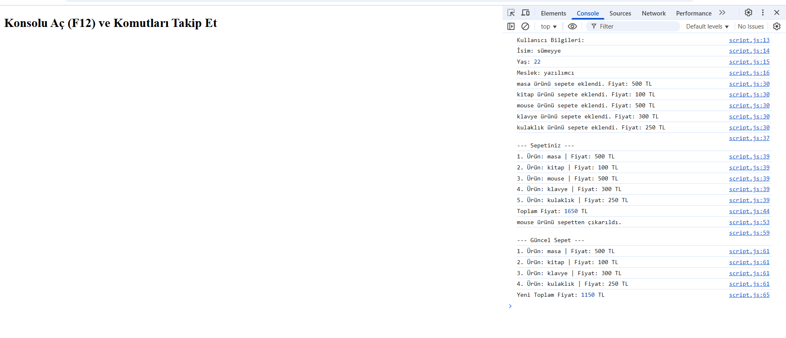

# js-cart-console-app
 🛒

Bu proje, JavaScript kullanarak bir alışveriş sepeti simülasyonudur. Uygulama tamamen kullanıcıdan alınan girdilerle tarayıcı konsolu üzerinden çalışır.

## 📌 Özellikler

- Kullanıcıdan isim, yaş ve meslek bilgisi alınır.
- Kullanıcı dilediği kadar ürün ekleyebilir.
- Her ürünün adı ve fiyatı ayrı ayrı girilir.
- Sepet ve toplam fiyat ekrana yazdırılır.
- Kullanıcı isterse bir ürünü sepetten çıkarabilir.
- Güncellenmiş sepet ve yeni toplam fiyat gösterilir.

## 🖥️ Nasıl Kullanılır?

1. `index.html` dosyasını tarayıcıda aç.
2. Konsolu (F12) aç.
3. Ekrandaki yönergelere göre bilgileri doldur.
4. Konsolda adım adım işlem çıktısını takip et.

## 🧪 Ekran Görüntüsü

Aşağıda uygulamanın çalışma anına ait bir ekran görüntüsü yer almaktadır:

## 📁 Dosya Yapısı
📦 shopping-cart-console-app
┣ 📄 index.html
┣ 📄 script.js
┗ 📄 README.md

